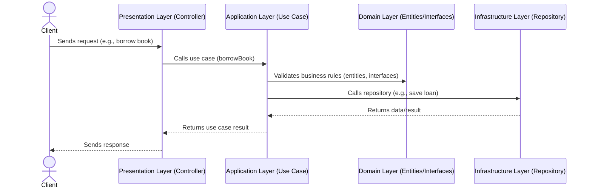

# Layered Architecture

## Overview

## Layers

### Domain Layer
- **Location:** `lib/domain`  
    The Domain Layer encapsulates the core business logic and rules of the system. It defines the main entities (`entities/book.ts`, `entities/loan.ts`, `entities/user.ts`), their behaviors, and the interfaces for repository abstractions (`interfaces/book-repository.ts`, `interfaces/user-repository.ts`). This layer is independent of any external frameworks or technologies, ensuring that business rules remain consistent and testable.  
    - **Tests:** Domain entity tests are in `entities/specs/`.

### Application Layer
- **Location:** `lib/application/use-cases`  
    The Application Layer coordinates tasks and workflows by orchestrating domain entities to fulfill specific use cases, such as borrowing a book (`borrow-book-use-case.ts`). It acts as a mediator between the domain and the outer layers, ensuring that business processes are executed according to the rules defined in the domain layer. This layer contains no business logic itself, but rather sequences and delegates work.

### Presentation Layer
- **Location:** `lib/presentation/controllers`  
    The Presentation Layer manages user interactions, such as HTTP requests or UI events. Controllers like `library-controller.ts` receive input, validate it, and translate it into application operations. This layer is responsible for communication with clients and formatting responses, but it does not contain business logic.

### Infrastructure Layer
- **Location:** `lib/infrastructure/repositories`  
    The Infrastructure Layer provides concrete implementations for technical concerns, such as data persistence and external integrations. It contains repository implementations (`in-memory-book-repository.ts`, `in-memory-user-repository.ts`) that fulfill the contracts defined in the domain layer. Tests for these implementations are located in the `specs/` directory. This layer can be swapped out or extended without affecting the core business logic.
