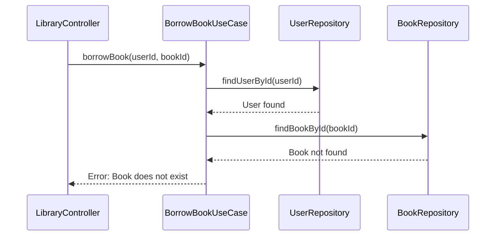
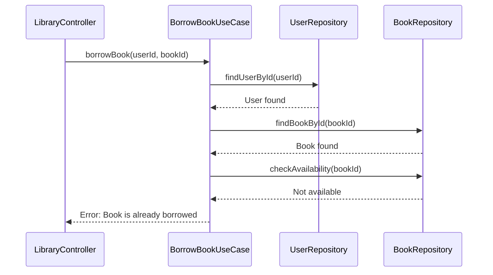
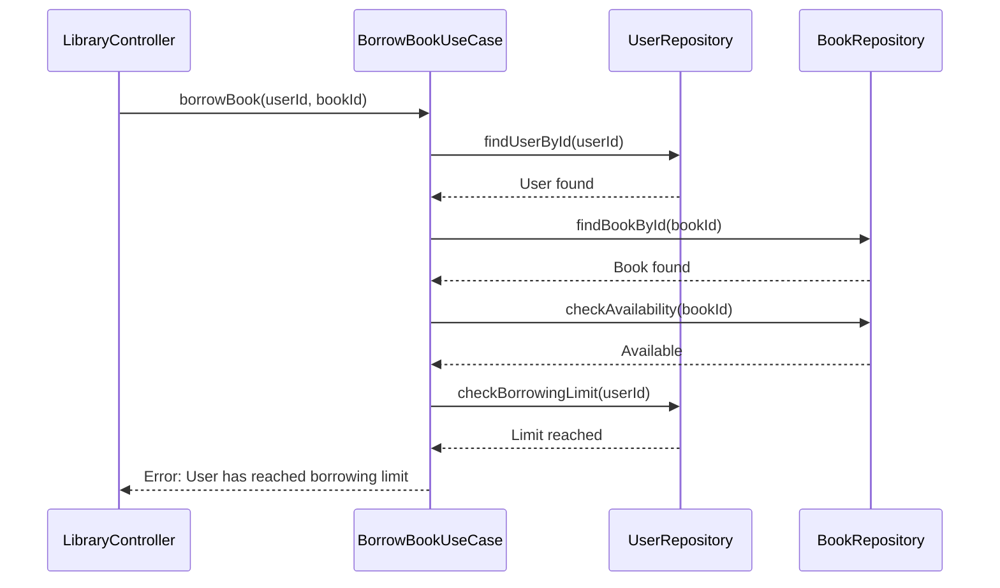

# Use Cases

The Library Management System supports the following core use cases:

## Borrow Book

This use case allows a user to borrow a book from the library.
**Flow:**
1. User requests to borrow a book
2. System verifies the user exists
3. System verifies the book exists
4. System checks if the book is available
5. System checks if the user has reached their borrowing limit
6. System marks the book as borrowed
7. System returns success message

```mermaid
sequenceDiagram
    actor User as LibraryUser
    actor Librarian as Librarian
    participant Controller as LibraryController
    participant UseCase as BorrowBookUseCase
    participant UserRepo as UserRepository
    participant BookRepo as BookRepository

    User->>Librarian: Request to borrow book (bookId)
    Librarian->>Controller: borrowBook(userId, bookId)
    Controller->>UseCase: borrowBook(userId, bookId)
    UseCase->>UserRepo: findUserById(userId)
    UseCase->>BookRepo: findBookById(bookId)
    UseCase->>BookRepo: checkAvailability(bookId)
    UseCase->>UserRepo: checkBorrowingLimit(userId)
    UseCase->>BookRepo: markAsBorrowed(bookId, userId)
    UseCase-->>Controller: Success/Failure response
    Controller-->>Librarian: Success/Failure response
    Librarian-->>User: Success/Failure response
````

**Error Conditions:**
- User does not exist

```mermaid
sequenceDiagram
    participant Controller as LibraryController
    participant UseCase as BorrowBookUseCase
    participant UserRepo as UserRepository

    Controller->>UseCase: borrowBook(userId, bookId)
    UseCase->>UserRepo: findUserById(userId)
    UserRepo-->>UseCase: User not found
    UseCase-->>Controller: Error: User does not exist
```

- Book does not exist



- Book is already borrowed



- User has reached their borrowing limit



## Return Book (Planned)

This use case would allow a user to return a previously borrowed book.

## List Available Books (Planned)

This use case would provide a list of all books that are currently available for borrowing.

## List User's Borrowed Books (Planned)

This use case would provide a list of all books currently borrowed by a specific user.
